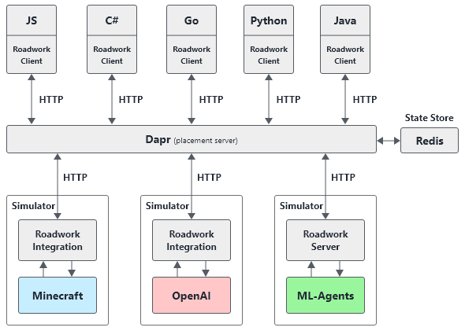

# Roadwork RL

> **Note:** This project is currently under heavy development and may change. It should not be used for production deployments yet.

Roadwork-RL is a Reinforcement Learning Platform that aims to act as an abstraction layer between the actual simulator integration and the algorithm acting on it. Its goal is to reduce the complexity required to spin up experiments that require a horizontally and isolated scaled simulator. It allows researchers to focus on the Reinforcement Learning algorithms.

## Architecture

A high-level architecture of the platform can be found below. The focus points of Roadwork-RL are:
* Code agnostic platform, allowing clients in different languages
* Easy simulator integrations
* The OpenAI Gym language



## Getting Started

Roadwork-RL is as easy as setting up the server environment on Kubernetes, whereafter Reinforcement Learning experiments can be ran on the cluster. To explain this, we have split the getting started guid into 2 different parts:

* **Simulation Cluster Creation:** This has to be done once (ideally by a server admin)
* **Running RL Experiments:** This can be executed by the Reinforcement Learning specialists with the commands they are used to.

### Getting Started - Creating the Simulation Cluster

1. Create a Simulation cluster as [shown here](/docs/getting-started/kubernetes.md).
2. Expose the URL as [shown here](/docs/getting-started/nginx-ingress-controller-setup.md).

### Getting Started - Running an Experiment

Once a Simulation cluster has been set-up, you can run an experiment. This is how you can run the Cartpole experiment provided in this repository:

```bash
# Configure the Roadwork Simulation Cluster IP Address to run the Experiment against
# E.g. export ROADWORK_SERVER_URL=https://20.190.28.131:443
# E.g. export ROADWORK_SERVER_URL=https://127.0.0.1:33843
export ROADWORK_SERVER_URL=https://<EXTERNAL-IP>

# Navigate to your experiment folder
cd <REPO ROOT>/src/Experiments/rllib/cartpole

# Execute your experiment
python3 train.py
```

```

### Getting Started - More information / development

For more information, feel free to check out the following documentation:

* [Running the simulation cluster in development mode](/docs/getting-started/development/linux.md)
* [Installing a Local Kubernetes cluster](/docs/getting-started/development/minikube.md)

## References

### Language SDKs Available

* [Python](./docs/sdk/python.md)
* [NodeJS](./docs/sdk/node.md) - WIP

### Simulators Implemented

* [OpenAI](https://github.com/openai/gym)

## References

* [High-Level Technical Overview](./docs/technical.md)
* [Protobuf Serialization](./docs/protobuf.md)
* [Spaces](./docs/spaces.md)
* [Simulators](./docs/simulators.md)
* [grpc.io](https://grpc.io)
* [Protobuf](https://github.com/protocolbuffers/protobuf)
* [Dapr](https://github.com/dapr/dapr)
* [Kubernetes](https://github.com/kubernetes/kubernetes)

## TODO

- [ ] Integrate [Facebook ReAgent](https://github.com/facebookresearch/ReAgent) on top of this
    * Simulation Observation Downloader
    * Trainer On-Policy & Off-Policy
- Add more simulators
  - [ ] [Unity ML-Agents](https://github.com/Unity-Technologies/ml-agents)
  - [ ] [Project Malmo](https://www.microsoft.com/en-us/research/project/project-malmo/)
- [ ] Performance Benchmarks (what is the impact of this library compared to a vanilla implemented)
* Create a custom language for state describing
    * Currently we can describe a state as shown before: `Tuple([ Box(0, 255, shape=(64, 64, 3)), Box(-50, 50, shape=(3, )) ])`. This might be too abstract or language dependent and could be done easier + more efficient. E.g. think of a Robotic arm, where we should be able to describe each join independently.