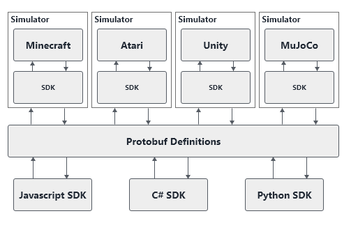

# Roadwork RL

> **Note:** This project is currently under heavy development and may change. It should not be used for production deployments yet.

Roadwork RL is a Reinforcement Learning that act as an abstraction layer between different simulation environments and languages, allowing for simulator &amp; code agnostic reinforcement learning research to be done.

As a simplified overview, the following diagram explains in more detail how this looks like from a **conceptual level**:

## Getting Started

Getting started is independent of the Operating System and only requires a **Kubernetes** cluster to be available capable of running **Linux Containers**. However to help with this the following documentation is available:

* [Windows](./getting-started/windows.md)
* [Linux](./getting-started/linux.md) - WIP

## Dependencies

* [grpc.io](https://grpc.io)
* [Protobuf](https://github.com/protocolbuffers/protobuf)
* [Dapr](https://github.com/dapr/dapr)
* [Kubernetes](https://github.com/kubernetes/kubernetes)

### Language SDKs Available

* [Python](./docs/sdk/python.md)
* [NodeJS](./docs/sdk/node.md) - WIP

### Simulators Implemented

* [OpenAI](https://github.com/openai/gym)

## References

* [High-Level Technical Overview](./docs/technical.md)
* [Protobuf Serialization](./docs/protobuf.md)
* [Spaces](./docs/spaces.md)
* [Simulators](./docs/simulators.md)

## TODO

* Integrate [Facebook ReAgent](https://github.com/facebookresearch/ReAgent) on top of this
    * Simulation Observation Downloader
    * Trainer On-Policy & Off-Policy
* Add [Project Malmo](https://www.microsoft.com/en-us/research/project/project-malmo/)
* Add [Unity ML-Agents](https://github.com/Unity-Technologies/ml-agents)
* Create a custom language for state describing
    * Currently we can describe a state as shown before: `Tuple([ Box(0, 255, shape=(64, 64, 3)), Box(-50, 50, shape=(3, )) ])`. This might be too abstract or language dependent and could be done easier + more efficient. E.g. think of a Robotic arm, where we should be able to describe each join independently.
* Performance Benchmarks (what is the impact of this library compared to a vanilla implemented)