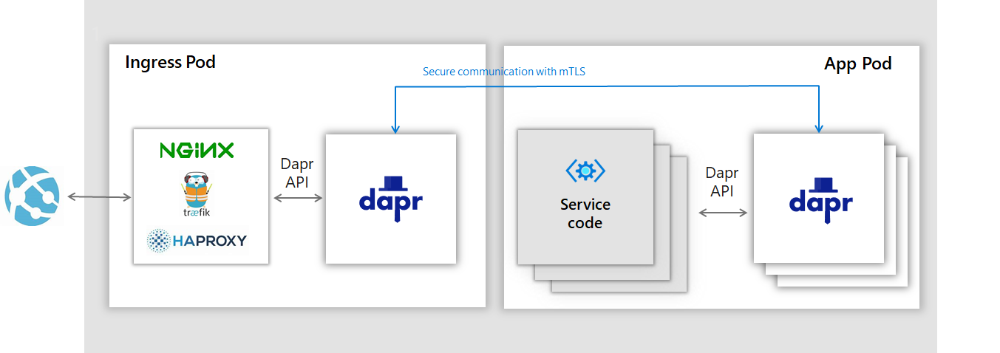

# NGINX Ingress Controller Setup with Dapr

### Prerequistes

- A working Kubernetes cluster with Dapr installed
- [Roadwork-RL Simulation Cluster](/docs/getting-started/kubernetes.md)

### Deploy the NGINX Ingress Controller with Dapr

We are going to “Daprize” the NGINX Ingress Controller so traffic flows as shown in the following picture:



```bash
# Add helm repo of kubernetes-charts
helm repo add stable https://kubernetes-charts.storage.googleapis.com/

# Install ingress controller using helm
helm install nginx stable/nginx-ingress -f src/Server/dapr/nginx/annotations.yaml -n default
```

### Setup TLS termination with certificate

```bash
# Generate certificate using openssl
openssl req -x509 -nodes -days 365 -newkey rsa:2048 -keyout tls.key -out tls.crt -subj "/CN=roadwork/O=roadwork"

# Create kubernetes secret store and add these certs on the store
kubectl create secret tls tls-secret --key tls.key --cert tls.crt
```

> Note: We use a local created certificate, however for Production use, a CA generated certificate should be utilized

### Deploy ingress rule

```bash
# Apply the ingress yaml in kubernetes which use the secret store created in previous step
kubectl apply -f src/Server/dapr/nginx/ingress.yaml
```

### Test the application

```bash
# Find the external public IP of the ingress service
kubectl get service --selector=app=nginx-ingress,component=controller -o jsonpath='{.items[*].status.loadBalancer.ingress[0].ip}'

# MINIKUBE: When using Minikube, the External-IP will not be available. Utilize the following command then:
minikube service nginx-nginx-ingress-controller

# Sample curl request to test the application
curl -k -X "PUT" -H "Host: roadwork" "http://<external_IP>:<secure_port(443)>/v1.0/actors/ActorOpenAI/roadwork-0-0/method/SimCreate" -H "Content-Type: application/json" -d '{"env_id":"CartPole-v1" }'

# Or make a Postman Put call with below details
  # Url: https://<external_IP>:<secure_port(443)>/v1.0/actors/ActorOpenAI/roadwork-0-0/method/SimCreate
  # Header: {'Host': 'roadwork'}
  # body: { "env_id": "CartPole-v1" }

# If everything runs as expected you should get the following result with status code 200:
null
```
