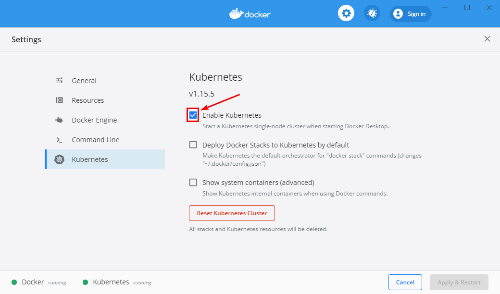

# Getting Started - Windows WSL 2

## 1. Prerequisites

### 1.1. WSL 2

The official supported method is to utilize WSL 2 under Windows 10 v2004, this due to the WSL 2 implementation that allows us to have a native Linux filesystem supported. Feel free to find more information in this excellent [Blog Post (Scott Hanselman)](https://www.hanselman.com/blog/HowToSetUpDockerWithinWindowsSystemForLinuxWSL2OnWindows10.aspx) on how-to set this up.

> **Note:** this entire getting started guide will be utilizing the WSL 2 environment - Aka Linux Shell

### 1.2. Kubernetes on WSL 2

Next to WSL 2, we are also going to run Dapr on Kubernetes. For this, it's easiest to utilize the "Kubernetes" setting in Docker itself when running on a local machine.



### 1.3.Setting up Dapr

The entire system runs on Dapr to have an easy to use State Management system that can be expanded to a remote environment when required. To install Dapr on Windows, we can run this simple script:

```powershell
# Install latest Linux Dapr CLI
wget -q https://raw.githubusercontent.com/dapr/cli/master/install/install.sh -O - | /bin/bash

# Initialize Dapr
dapr init --kubernetes
```

> **Note:** For more information on Dapr, find the repository here: [https://github.com/dapr/dapr](https://github.com/dapr/dapr)

Once this is done, we can get the deployments running through `kubectl get deployments`:

```bash
NAME                    READY   UP-TO-DATE   AVAILABLE   AGE
dapr-operator           1/1     1            1           24h
dapr-placement          1/1     1            1           24h
dapr-sentry             1/1     1            1           24h
dapr-sidecar-injector   1/1     1            1           24h
```

## 2. Running first Experiment

After the above is done, you can run your first experiment. To do so, run the following commands in 2 different terminals in the `src/` folder.

```bash
# Start OpenAI Gym Server
# Note: this will start the server and keep on running
#       this is a Kubernetes "deployment"
sudo ./Scripts/build.sh Servers/openai/ roadwork/rw-server-openai
./Scripts/start.sh rw-server-openai

# Start Python Experiment - CartPole
# Note: this will execute the experiment and stop afterwards
#       this is a Kubernetes "pod"
sudo ./Scripts/build.sh Clients/python/experiments/cartpole roadwork/rw-client-python-cartpole
./Scripts/start-client.sh rw-client-python-cartpole
```

## 3. Viewing Logs

Logging should automatically be attached after running but can be re-opened through the following command:

```bash
# View Server Logs
./Scripts/log.sh rw-server-openai

# View Client Logs
./Scripts/log-client.sh rw-client-python-cartpole
```

## 4. Getting Results

Once runs are done, you can get results from the server by utilizing the following command:

```bash
./Scripts/get-output-server.sh rw-server-openai /mnt/f/test
```