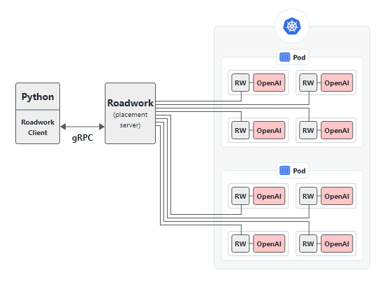

# Roadwork-RL through Dapr - Work in progress

## Architecture




## Debug


## Installation

For fresh install the following steps were followed:

```bash
# 1. Dapr Install
wget -q https://raw.githubusercontent.com/dapr/cli/master/install/install.sh -O - | /bin/bash
> https://github.com/dapr/docs/blob/master/getting-started/environment-setup.md

sudo dapr init

# 2. Dapr Dev Python install
# Note: 3.7 is required for Asyncio.run to be available
git clone https://github.com/dapr/python-sdk.git
modify setup.cfg and change > 3.8 to > 3.7
pip install -e

# 3. Dependencies (Gym, Dapr Actor and Roadwork)
sudo apt-get install ffmpeg python-opengl xvfb
sudo pip3 install gym
sudo pip3 install flask
sudo pip3 install -r dev-requirements.txt # in src-dapr/
sudo pip3 install nest-asyncio
sudo pip3 install stable-baselines # client only
sudo pip3 install tensorflow==1.14.0

# 4. Install Roadwork Library
cd src/Lib/python/roadwork
sudo pip install -e .
```

## PyPi

```bash
# Deploying package
./Scripts/windows/deploy-python-package.ps1
```

## Getting Started

### Locally - Setting up Python 3.7

```bash
# Install Python 3.7
sudo add-apt-repository ppa:deadsnakes/ppa
sudo apt update
sudo apt install python3.7 -y

# Set Python 3.7 as our default
sudo update-alternatives --config python3
sudo update-alternatives --install /usr/bin/python3 python3 /usr/bin/python3.7 1

# Relink
sudo rm /usr/bin/python3
sudo ln -s /usr/bin/python3.7 /usr/bin/python3

# Install Pip (also for sudo)
curl -s https://bootstrap.pypa.io/get-pip.py | python3
sudo curl -s https://bootstrap.pypa.io/get-pip.py | sudo python3

# Reconfigure Apt (note: not working yet...)
# Note: required us to look at https://packages.ubuntu.com/focal/python3-apt for the package of python == 3.7
# sudo apt remove --purge python-apt python3-apt -y
# wget http://security.ubuntu.com/ubuntu/pool/main/p/python-apt/python3-apt_1.9.0ubuntu1.3_amd64.deb | sudo apt install
# wget http://nl.archive.ubuntu.com/ubuntu/pool/main/p/pygobject/python3-gi_3.34.0-1_amd64.deb | sudo apt install

# sudo apt install -y apt-transport-https ca-certificates curl gnupg-agent software-properties-common
# sudo cp /usr/lib/python3/dist-packages/apt_pkg.cpython-37-x86_64-linux-gnu.so /usr/lib/python3/dist-packages/apt_pkg.so
# http://nl.archive.ubuntu.com/ubuntu/pool/main/p/pygobject/python3-gi_3.34.0-1_amd64.deb
# sudo apt install python-apt python3-apt -y
```

### Locally - Installation

```bash
# Install dependencies
sudo apt install -y --no-install-recommends apt-utils build-essential curl xvfb ffmpeg xorg-dev libsdl2-dev swig cmake python-opengl dos2unix

# Install Docker
sudo apt install -y apt-transport-https ca-certificates curl gnupg-agent software-properties-common
# curl -fsSL https://download.docker.com/linux/ubuntu/gpg | sudo apt-key add -
# sudo add-apt-repository "deb [arch=amd64] https://download.docker.com/linux/ubuntu $(lsb_release -cs) stable"
# sudo apt install docker-ce docker-ce-cli containerd.io
sudo apt install docker.io

# Install Dapr (https://github.com/dapr/docs/blob/master/getting-started/environment-setup.md)
wget -q https://raw.githubusercontent.com/dapr/cli/master/install/install.sh -O - | /bin/bash

# Navigate to home dir
cd

# Install Dapr/Dapr-Flask + Patch it for Python 3.7
git clone https://github.com/dapr/python-sdk.git dapr-python-sdk
cd dapr-python-sdk; sed -i 's/python_requires = >=3.8/python_requires = >=3.7/g' setup.cfg; sudo pip3 install -e .; cd ..;
cd dapr-python-sdk/ext/flask_dapr; sed -i 's/python_requires = >=3.8/python_requires = >=3.7/g' setup.cfg; sudo pip3 install -e .; cd ../../../;

# Clone Roadwork
cd
git clone https://github.com/roadwork/roadwork-rl

# Install Roadwork Python SDK
cd ~/roadwork-rl/src/Lib/pyton/roadwork
sudo pip3 install -e .

# Install requirements Server
cd ~/roadwork-rl/src/Server
sudo pip3 install -r requirements.txt

# Install requirements Client
cd ~/roadwork-rl/src/Experiments/baselines/cartpole
sudo pip3 install -r requirements.txt

# Init Dapr
sudo dapr init
```

### Locally - Running

### Server

```bash
# 1. Start X Server for rendering
sudo Xvfb -screen 0 1024x768x24 &
export DISPLAY=:0

# 2. Navigate to Dapr Folder
cd src/Server

# 3. Run Main Server (containing OpenAI)
sudo dapr run --app-id demo-actor --app-port 3000 python3 ./Server/main.py
```

### Client

```bash
# 1. Run Experiment (in different window, also in src-dapr folder)
sudo dapr run --app-id demo-client python3 ./Experiments/baselines/cartpole/train.py
```

## Kubernetes

### Server

#### 1. Installing Redis

```bash
# Install Helm
# https://helm.sh/docs/intro/install/
curl -fsSL -o get_helm.sh https://raw.githubusercontent.com/helm/helm/master/scripts/get-helm-3
chmod 700 get_helm.sh
./get_helm.sh

# Install redis into cluster
helm repo add bitnami https://charts.bitnami.com/bitnami
helm install redis bitnami/redis

echo "Redis is now running, credentials:"
echo "Host: redis-master:6379"
echo "Password: $(kubectl get secret --namespace default redis -o jsonpath="{.data.redis-password}" | base64 --decode)"
```

#### 2. Installing Server

```bash
# Build Server
./Scripts/linux/build-server.sh Server/ roadwork.io/sim-server

# Remove old Server
kubectl delete deployment rw-server

# Start Server
kubectl apply -f Server/kubernetes.yaml

# Get Logs
kubectl logs -f deployment/rw-server -c server -f
```

### Client

```bash
# Build Client
./Scripts/linux/build-client.sh Experiments/baselines/cartpole roadwork.io/rw-exp-baselines-cartpole

# Remove old Client
kubectl delete pod p-rw-exp-cartpole

# Start Client
kubectl apply -f Experiments/baselines/cartpole/kubernetes.yaml

# Get Logs
kubectl logs pod/p-rw-exp-cartpole -c experiment -f
```